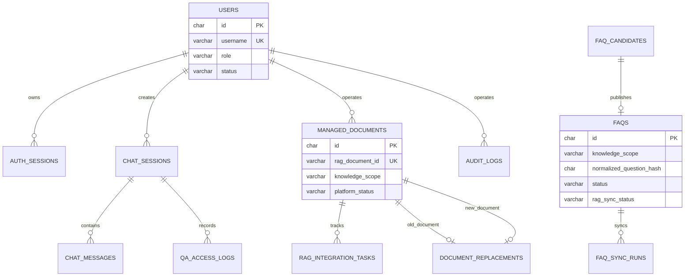
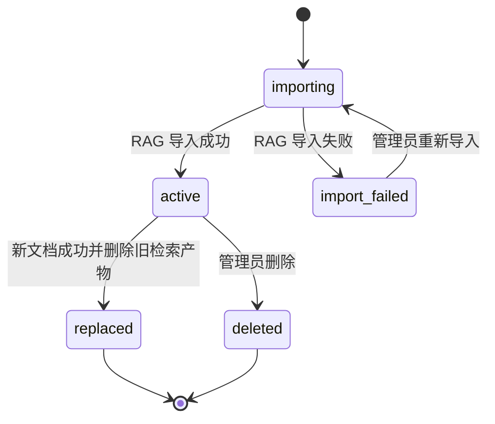
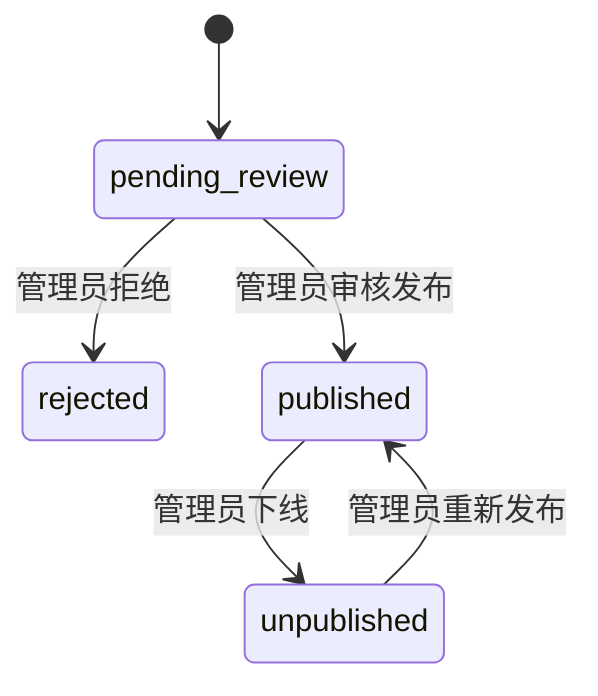
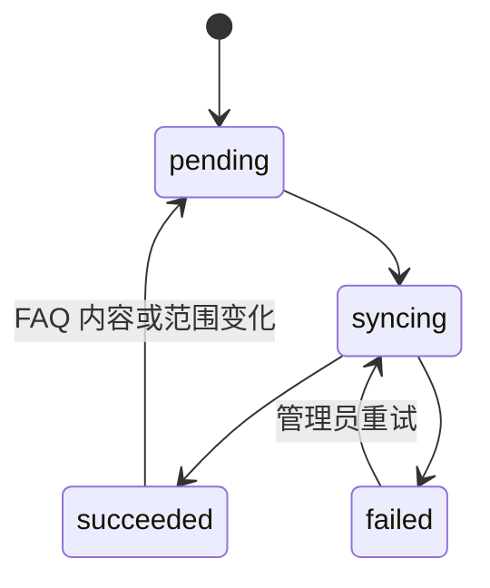
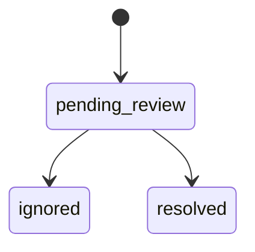

# 券商财富业务知识管理平台：数据对象设计

## 0. 文档用途

本文规定平台领域对象、MySQL（关系型数据库）表、Redis（缓存数据库）对象、原 RAG（检索增强生成）上游对象映射、状态枚举、约束和生命周期。

执行 Agent（执行智能体）必须以本文字段名和语义为基线。未经确认不得临时增加部门权限、个人权限、员工反馈、第二套向量数据或重复保存完整 RAG 文档正文。

配套文档：

- [概要设计总纲](./2.9_券商财富业务知识管理平台_概要设计总纲.md)
- [API 接口设计](./2.9_券商财富业务知识管理平台_API接口设计.md)

---

## 1. 数据设计原则

### 1.1 唯一事实来源

| 数据 | 唯一事实来源 | 平台是否复制 |
|---|---|---|
| Dataset（知识库） | 原 RAG（检索增强生成）MongoDB（文档数据库） | 只保存固定 ID 配置，不复制完整记录 |
| Document（文档）状态 | 原 RAG（检索增强生成）MongoDB（文档数据库） | 保存轻量映射和最后一次快照 |
| Chunk（文本块）正文与启停 | 原 RAG（检索增强生成）Milvus（向量数据库）+ MongoDB（文档数据库）覆盖层 | 不落 MySQL，只通过 API（应用程序接口）实时读取 |
| 向量与检索索引 | 原 RAG（检索增强生成）Milvus（向量数据库） | 禁止复制 |
| Trace（执行追踪） | 原 RAG（检索增强生成）MongoDB（文档数据库） | 只保存 `trace_id` 和看板需要的快照 |
| 平台用户与登录态 | 平台 MySQL（关系型数据库） | 平台唯一维护 |
| FAQ（常见问题）正式状态 | 平台 MySQL（关系型数据库） | Redis 只是可重建缓存 |
| 知识缺口候选 | 平台 MySQL（关系型数据库） | 平台唯一维护 |
| 平台访问日志和操作审计 | 平台 MySQL（关系型数据库） | 平台唯一维护 |

### 1.2 不重复保存正文

`managed_documents`（平台文档映射）不得保存完整源文件、完整解析正文或全部 Chunk（文本块）。页面需要时，通过 `rag_document_id`（RAG 文档 ID）调用原 RAG（检索增强生成）查询。

允许保存：

- 文件名；
- 数据范围；
- 上游状态快照；
- Chunk（文本块）数量；
- 索引版本；
- 错误摘要；
- 新旧文档替换关系。

### 1.3 时间与标识

- 平台主键统一使用 UUID，MySQL（关系型数据库）类型为 `CHAR(36)`；
- 原 RAG（检索增强生成）ID 保持原字符串，不重新编码；
- 时间统一存储 UTC，MySQL（关系型数据库）使用 `DATETIME(6)`；
- API（应用程序接口）输出使用带时区 ISO 8601；
- 表名和字段名使用 `snake_case`（小写下划线命名）；
- 状态使用字符串枚举，不使用 MySQL 原生 `ENUM`，便于 Alembic（数据库结构版本工具）演进。

---

## 2. 核心枚举

### 2.1 用户

| 枚举 | 值 | 业务语义 |
|---|---|---|
| `UserRole`（用户角色） | `admin` | 管理员，可管理和查询全部范围 |
|  | `employee` | 普通员工，只能查询外部公开和内部共享知识 |
| `UserStatus`（用户状态） | `active` | 正常登录和访问 |
|  | `disabled` | 禁止登录，已有 JWT（登录令牌）立即失效 |

外部用户不进入 `users` 表，不作为平台登录角色。

### 2.2 知识范围

| 枚举 | 值 | RAG Dataset（知识库） |
|---|---|---|
| `KnowledgeScope`（知识范围） | `external_public` | `securities_external_public` |
|  | `internal_shared` | `securities_internal_shared` |
|  | `admin_private` | `securities_admin_private` |

Dataset（知识库）实际 ID 来自环境变量，表中保存稳定的范围枚举与当次上游 ID 快照。

### 2.3 调用渠道与答案来源

| 枚举 | 值 | 业务语义 |
|---|---|---|
| `AccessChannel`（访问渠道） | `internal_web` | 管理员或普通员工通过平台页面访问 |
|  | `external_api` | 问问小安后续通过服务接口访问 |
| `AnswerSource`（答案来源） | `faq_cache` | Redis/MySQL FAQ 精确命中 |
|  | `rag` | 原 RAG（检索增强生成）返回 |
|  | `none` | 未产生有效答案 |

### 2.4 平台任务

| 枚举 | 值 |
|---|---|
| `IntegrationOperation`（集成操作） | `dataset_bootstrap`、`document_import`、`document_rebuild`、`document_replace`、`faq_sync` |
| `IntegrationTaskStatus`（集成任务状态） | `pending`、`running`、`succeeded`、`failed`、`cancelled` |

平台不得把未知上游状态自动映射成成功。未知状态应保留原值并映射为 `running` 或明确失败，由适配层记录原因。

### 2.5 文档平台状态

| 枚举 | 值 | 业务语义 |
|---|---|---|
| `ManagedDocumentStatus`（平台文档状态） | `importing` | 上游仍在处理 |
|  | `active` | 上游完成且当前有效 |
|  | `import_failed` | 上游导入失败 |
|  | `replaced` | 已被新文档替换 |
|  | `deleted` | 已调用上游删除并软删除映射 |

`rag_status`（RAG 原始状态）单独保存，不能用平台状态覆盖。

### 2.6 FAQ 与知识缺口

| 枚举 | 值 |
|---|---|
| `FaqCandidateStatus`（FAQ 候选状态） | `pending_review`、`published`、`rejected` |
| `FaqStatus`（FAQ 状态） | `published`、`unpublished` |
| `RagSyncStatus`（RAG 同步状态） | `pending`、`syncing`、`succeeded`、`failed` |
| `KnowledgeGapStatus`（知识缺口候选状态） | `pending_review`、`ignored`、`resolved` |

### 2.7 消息状态

| 枚举 | 值 |
|---|---|
| `MessageRole`（消息角色） | `user`、`assistant` |
| `MessageStatus`（消息状态） | `pending`、`streaming`、`completed`、`failed` |
| `SessionStatus`（会话状态） | `active`、`archived`、`deleted` |

---

## 3. 对象关系



---

## 4. MySQL 表设计

## 4.1 `users`

平台内部账号。外部用户不入表。

| 字段 | 类型 | 必填 | 说明 |
|---|---|---:|---|
| `id` | `CHAR(36)` | 是 | UUID 主键 |
| `username` | `VARCHAR(64)` | 是 | 登录名，全局唯一，统一转小写 |
| `display_name` | `VARCHAR(100)` | 是 | 页面展示名 |
| `password_hash` | `VARCHAR(255)` | 是 | 安全密码哈希，禁止保存明文 |
| `role` | `VARCHAR(20)` | 是 | `admin` 或 `employee` |
| `status` | `VARCHAR(20)` | 是 | `active` 或 `disabled` |
| `password_changed_at` | `DATETIME(6)` | 是 | 最近密码变更时间 |
| `last_login_at` | `DATETIME(6)` | 否 | 最近成功登录时间 |
| `created_by_user_id` | `CHAR(36)` | 否 | 初始管理员可为空 |
| `created_at` | `DATETIME(6)` | 是 | 创建时间 |
| `updated_at` | `DATETIME(6)` | 是 | 更新时间 |
| `disabled_at` | `DATETIME(6)` | 否 | 停用时间 |

约束与索引：

- `UNIQUE(username)`；
- `INDEX(status, role)`；
- 至少保留一个有效管理员；
- 管理员不能停用自己；
- 重置密码必须更新 `password_changed_at`，使旧令牌失效。

## 4.2 `auth_sessions`

JWT（登录令牌）会话和主动撤销记录。

| 字段 | 类型 | 必填 | 说明 |
|---|---|---:|---|
| `id` | `CHAR(36)` | 是 | 会话 ID |
| `user_id` | `CHAR(36)` | 是 | 关联用户 |
| `jti_hash` | `CHAR(64)` | 是 | JWT 唯一标识的 SHA-256，不保存原令牌 |
| `issued_at` | `DATETIME(6)` | 是 | 签发时间 |
| `expires_at` | `DATETIME(6)` | 是 | 到期时间 |
| `revoked_at` | `DATETIME(6)` | 否 | 主动退出或管理员撤销时间 |
| `client_ip` | `VARCHAR(64)` | 否 | 脱敏或规范化 IP |
| `user_agent` | `VARCHAR(500)` | 否 | 客户端摘要 |
| `created_at` | `DATETIME(6)` | 是 | 创建时间 |

约束与索引：

- `UNIQUE(jti_hash)`；
- `INDEX(user_id, expires_at)`；
- 每次鉴权同时检查用户状态、`password_changed_at` 和会话是否撤销。

## 4.3 `managed_documents`

平台对原 RAG Document（文档）的轻量映射。

| 字段 | 类型 | 必填 | 说明 |
|---|---|---:|---|
| `id` | `CHAR(36)` | 是 | 平台文档 ID |
| `rag_document_id` | `VARCHAR(120)` | 是 | 原 RAG 文档 ID，全局唯一 |
| `rag_dataset_id` | `VARCHAR(120)` | 是 | 当次 Dataset（知识库）ID |
| `knowledge_scope` | `VARCHAR(32)` | 是 | 三档知识范围之一 |
| `file_name` | `VARCHAR(255)` | 是 | 原始文件名 |
| `source_kind` | `VARCHAR(32)` | 是 | `manual_upload` 或 `faq_generated` |
| `index_version` | `INT UNSIGNED` | 是 | 原 RAG 文档索引版本 |
| `rag_status` | `VARCHAR(40)` | 是 | 原 RAG 原始状态，不改写 |
| `rag_parse_status` | `VARCHAR(40)` | 否 | 原解析状态 |
| `rag_index_status` | `VARCHAR(40)` | 否 | 原索引状态 |
| `platform_status` | `VARCHAR(32)` | 是 | 平台文档状态 |
| `chunk_count` | `INT UNSIGNED` | 是 | 最近同步的 Chunk 数 |
| `latest_rag_task_id` | `VARCHAR(120)` | 否 | 最近上游任务 ID |
| `error_code` | `VARCHAR(100)` | 否 | 最近机器错误码 |
| `error_message` | `VARCHAR(1000)` | 否 | 已脱敏错误摘要 |
| `created_by_user_id` | `CHAR(36)` | 是 | 平台管理员 ID |
| `created_at` | `DATETIME(6)` | 是 | 创建时间 |
| `updated_at` | `DATETIME(6)` | 是 | 更新时间 |
| `deleted_at` | `DATETIME(6)` | 否 | 平台软删除时间 |

约束与索引：

- `UNIQUE(rag_document_id)`；
- `INDEX(knowledge_scope, platform_status, updated_at)`；
- `INDEX(rag_dataset_id, rag_status)`；
- `rag_document_id` 创建后不可修改；
- 完整正文和完整 Chunk 列表不得进入本表。

## 4.4 `rag_integration_tasks`

平台与原 RAG（检索增强生成）之间的长操作映射。

| 字段 | 类型 | 必填 | 说明 |
|---|---|---:|---|
| `id` | `CHAR(36)` | 是 | 平台任务 ID |
| `operation` | `VARCHAR(32)` | 是 | 集成操作枚举 |
| `status` | `VARCHAR(20)` | 是 | 平台任务状态 |
| `managed_document_id` | `CHAR(36)` | 否 | 文档映射 ID |
| `rag_task_id` | `VARCHAR(120)` | 否 | 上游任务 ID |
| `rag_document_id` | `VARCHAR(120)` | 否 | 上游文档 ID |
| `rag_dataset_id` | `VARCHAR(120)` | 是 | 上游 Dataset（知识库）ID |
| `rag_status` | `VARCHAR(40)` | 否 | 最近原始状态 |
| `done_nodes_json` | `JSON` | 是 | 上游完成节点列表 |
| `running_nodes_json` | `JSON` | 是 | 上游运行节点列表 |
| `failed_node` | `VARCHAR(120)` | 否 | 上游失败节点 |
| `error_code` | `VARCHAR(100)` | 否 | 机器错误码 |
| `error_message` | `VARCHAR(1000)` | 否 | 脱敏错误摘要 |
| `requested_by_user_id` | `CHAR(36)` | 是 | 发起管理员 |
| `started_at` | `DATETIME(6)` | 否 | 开始时间 |
| `finished_at` | `DATETIME(6)` | 否 | 结束时间 |
| `created_at` | `DATETIME(6)` | 是 | 创建时间 |
| `updated_at` | `DATETIME(6)` | 是 | 更新时间 |

约束与索引：

- `UNIQUE(rag_task_id)`，允许 `NULL`；
- `INDEX(status, updated_at)`；
- 上游失败详情只保存安全摘要，完整堆栈进入服务日志。

## 4.5 `document_replacements`

新文档成功后替换旧文档的审计关系。

| 字段 | 类型 | 必填 | 说明 |
|---|---|---:|---|
| `id` | `CHAR(36)` | 是 | 替换记录 ID |
| `old_managed_document_id` | `CHAR(36)` | 是 | 旧文档 |
| `new_managed_document_id` | `CHAR(36)` | 是 | 新文档 |
| `replacement_task_id` | `CHAR(36)` | 否 | 对应集成任务 |
| `status` | `VARCHAR(20)` | 是 | `pending`、`completed`、`failed` |
| `error_message` | `VARCHAR(1000)` | 否 | 失败摘要 |
| `created_by_user_id` | `CHAR(36)` | 是 | 操作管理员 |
| `created_at` | `DATETIME(6)` | 是 | 创建时间 |
| `completed_at` | `DATETIME(6)` | 否 | 完成时间 |

约束：

- 新旧文档不能相同；
- 新旧文档必须属于同一 `knowledge_scope`（知识范围）；
- 新文档未完成导入时，不得删除旧文档；
- `completed` 后旧文档平台状态为 `replaced`。

## 4.6 `chat_sessions`

平台内部员工会话；外部 API（应用程序接口）也可保存轻量会话映射。

| 字段 | 类型 | 必填 | 说明 |
|---|---|---:|---|
| `id` | `CHAR(36)` | 是 | 平台会话 ID |
| `channel` | `VARCHAR(24)` | 是 | `internal_web` 或 `external_api` |
| `user_id` | `CHAR(36)` | 否 | 内部用户；外部调用为空 |
| `external_subject_hash` | `CHAR(64)` | 否 | 外部用户标识哈希，不存原始敏感 ID |
| `external_session_id` | `VARCHAR(120)` | 否 | 问问小安后续会话 ID |
| `title` | `VARCHAR(200)` | 是 | 会话标题 |
| `status` | `VARCHAR(20)` | 是 | 会话状态 |
| `last_message_at` | `DATETIME(6)` | 否 | 最近消息时间 |
| `created_at` | `DATETIME(6)` | 是 | 创建时间 |
| `updated_at` | `DATETIME(6)` | 是 | 更新时间 |
| `deleted_at` | `DATETIME(6)` | 否 | 软删除时间 |

约束：

- `internal_web` 必须有 `user_id`；
- `external_api` 不得绑定平台员工账号；
- 外部用户标识只用于统计和追踪，不参与知识范围计算。

## 4.7 `chat_messages`

会话消息与最终交付快照。

| 字段 | 类型 | 必填 | 说明 |
|---|---|---:|---|
| `id` | `CHAR(36)` | 是 | 消息 ID |
| `session_id` | `CHAR(36)` | 是 | 平台会话 ID |
| `turn_id` | `CHAR(36)` | 是 | 一问一答共享的轮次 ID |
| `seq_no` | `INT UNSIGNED` | 是 | 会话内严格递增序号 |
| `role` | `VARCHAR(16)` | 是 | `user` 或 `assistant` |
| `content` | `LONGTEXT` | 是 | 问题或最终答案 |
| `status` | `VARCHAR(20)` | 是 | 消息状态 |
| `answer_source` | `VARCHAR(20)` | 否 | 仅助手消息使用 |
| `rag_trace_id` | `VARCHAR(120)` | 否 | RAG 返回的 Trace ID |
| `terminal_reason_code` | `VARCHAR(100)` | 否 | RAG 终止原因 |
| `citations_json` | `JSON` | 是 | Citation（引用来源）快照，默认 `[]` |
| `error_code` | `VARCHAR(100)` | 否 | 失败错误码 |
| `created_at` | `DATETIME(6)` | 是 | 创建时间 |
| `completed_at` | `DATETIME(6)` | 否 | 完成时间 |

约束与索引：

- `UNIQUE(session_id, seq_no)`；
- `INDEX(turn_id)`；
- `INDEX(rag_trace_id)`；
- 流式增量不逐 Token（模型计量单位）写库，只在结束或失败时写最终结果。

## 4.8 `qa_access_logs`

每次问答轮次的运营和看板事实。

| 字段 | 类型 | 必填 | 说明 |
|---|---|---:|---|
| `id` | `CHAR(36)` | 是 | 日志 ID |
| `turn_id` | `CHAR(36)` | 是 | 一问一答轮次 ID，唯一 |
| `session_id` | `CHAR(36)` | 是 | 平台会话 ID |
| `channel` | `VARCHAR(24)` | 是 | 访问渠道 |
| `user_id` | `CHAR(36)` | 否 | 内部用户 |
| `external_subject_hash` | `CHAR(64)` | 否 | 外部用户匿名标识 |
| `question` | `TEXT` | 是 | 原始问题 |
| `normalized_question` | `TEXT` | 是 | FAQ 候选归一化问题 |
| `normalized_question_hash` | `CHAR(64)` | 是 | 归一化问题 SHA-256 |
| `allowed_scopes_json` | `JSON` | 是 | 本次允许范围 |
| `answer_source` | `VARCHAR(20)` | 是 | FAQ、RAG 或无答案 |
| `faq_id` | `CHAR(36)` | 否 | 精确命中的 FAQ |
| `rag_trace_id` | `VARCHAR(120)` | 否 | RAG Trace ID |
| `terminal_reason_code` | `VARCHAR(100)` | 否 | RAG 终止原因 |
| `citation_count` | `INT UNSIGNED` | 是 | 引用数量 |
| `citation_document_ids_json` | `JSON` | 是 | 热门知识统计所需文档 ID |
| `input_tokens` | `INT UNSIGNED` | 否 | 实际可获取值 |
| `output_tokens` | `INT UNSIGNED` | 否 | 实际可获取值 |
| `total_tokens` | `INT UNSIGNED` | 否 | 实际可获取值 |
| `latency_ms` | `INT UNSIGNED` | 是 | 平台端到端耗时 |
| `status` | `VARCHAR(20)` | 是 | `succeeded` 或 `failed` |
| `error_code` | `VARCHAR(100)` | 否 | 系统错误码 |
| `created_at` | `DATETIME(6)` | 是 | 创建时间 |

约束与索引：

- `UNIQUE(turn_id)`；
- `INDEX(channel, created_at)`；
- `INDEX(normalized_question_hash, created_at)`；
- `INDEX(rag_trace_id)`；
- Token（模型计量单位）不可获取时为 `NULL`，不得填估算值；
- 系统错误不得自动生成知识缺口。

## 4.9 `faq_candidates`

管理员手动触发日志分析后产生的 FAQ（常见问题）候选。

| 字段 | 类型 | 必填 | 说明 |
|---|---|---:|---|
| `id` | `CHAR(36)` | 是 | 候选 ID |
| `knowledge_scope` | `VARCHAR(32)` | 是 | 候选范围 |
| `normalized_question` | `TEXT` | 是 | 归一化标准问题 |
| `normalized_question_hash` | `CHAR(64)` | 是 | SHA-256 |
| `sample_questions_json` | `JSON` | 是 | 原问题样例，限制数量 |
| `ask_count` | `INT UNSIGNED` | 是 | 累计频次 |
| `suggested_answer` | `LONGTEXT` | 否 | 可为空，不能未经审核发布 |
| `source_log_ids_json` | `JSON` | 是 | 来源日志 ID，限制数量 |
| `status` | `VARCHAR(24)` | 是 | 候选状态 |
| `published_faq_id` | `CHAR(36)` | 否 | 发布后的 FAQ ID |
| `generated_at` | `DATETIME(6)` | 是 | 最近生成时间 |
| `reviewed_by_user_id` | `CHAR(36)` | 否 | 审核管理员 |
| `reviewed_at` | `DATETIME(6)` | 否 | 审核时间 |

约束：

- `UNIQUE(knowledge_scope, normalized_question_hash)`；
- 已发布标准问题不重复创建候选，只更新已发布 FAQ 的统计；
- 第一版只按归一化精确值聚合，不声称语义聚类。

## 4.10 `faqs`

管理员审核后的正式 FAQ（常见问题）。

| 字段 | 类型 | 必填 | 说明 |
|---|---|---:|---|
| `id` | `CHAR(36)` | 是 | FAQ ID |
| `knowledge_scope` | `VARCHAR(32)` | 是 | 三档范围之一 |
| `question` | `TEXT` | 是 | 标准问题 |
| `normalized_question` | `TEXT` | 是 | 归一化问题 |
| `normalized_question_hash` | `CHAR(64)` | 是 | SHA-256 |
| `answer` | `LONGTEXT` | 是 | 管理员审核后的标准答案 |
| `status` | `VARCHAR(20)` | 是 | `published` 或 `unpublished` |
| `source_candidate_id` | `CHAR(36)` | 否 | 来源候选 |
| `hit_count` | `BIGINT UNSIGNED` | 是 | 精确缓存累计命中数 |
| `rag_sync_status` | `VARCHAR(20)` | 是 | 当前范围 FAQ 文档同步状态 |
| `rag_sync_error` | `VARCHAR(1000)` | 否 | 最近同步失败摘要 |
| `created_by_user_id` | `CHAR(36)` | 是 | 发布管理员 |
| `reviewed_by_user_id` | `CHAR(36)` | 是 | 审核管理员，本期可与创建人相同 |
| `published_at` | `DATETIME(6)` | 是 | 发布时间 |
| `updated_at` | `DATETIME(6)` | 是 | 更新时间 |
| `unpublished_at` | `DATETIME(6)` | 否 | 下线时间 |

约束与索引：

- `UNIQUE(knowledge_scope, normalized_question_hash)`；
- `INDEX(knowledge_scope, status)`；
- 下线不物理删除；
- 缓存键必须包含 `knowledge_scope`；
- 修改问题时重新计算归一化值和哈希；
- 修改、发布、下线均触发对应范围 FAQ 文档重建。

## 4.11 `faq_sync_runs`

每个知识范围汇总 FAQ Markdown 文档的同步执行记录。

| 字段 | 类型 | 必填 | 说明 |
|---|---|---:|---|
| `id` | `CHAR(36)` | 是 | 同步记录 ID |
| `knowledge_scope` | `VARCHAR(32)` | 是 | 目标范围 |
| `content_hash` | `CHAR(64)` | 是 | 生成文档 SHA-256 |
| `generated_file_name` | `VARCHAR(255)` | 是 | 固定范围文件名 |
| `status` | `VARCHAR(20)` | 是 | RAG 同步状态 |
| `rag_task_id` | `VARCHAR(120)` | 否 | 上游任务 ID |
| `rag_document_id` | `VARCHAR(120)` | 否 | 当前成功文档 ID |
| `previous_rag_document_id` | `VARCHAR(120)` | 否 | 被替换文档 ID |
| `error_code` | `VARCHAR(100)` | 否 | 错误码 |
| `error_message` | `VARCHAR(1000)` | 否 | 脱敏错误摘要 |
| `requested_by_user_id` | `CHAR(36)` | 是 | 操作管理员 |
| `created_at` | `DATETIME(6)` | 是 | 创建时间 |
| `finished_at` | `DATETIME(6)` | 否 | 完成时间 |

约束：

- 相同范围、相同 `content_hash` 已成功时直接幂等返回；
- 新 FAQ 文档成功前，不删除旧 FAQ 文档；
- 失败时 MySQL 正式 FAQ 和精确缓存继续可用。

## 4.12 `knowledge_gap_candidates`

轻量知识缺口候选，不表示已经确认缺少知识。

| 字段 | 类型 | 必填 | 说明 |
|---|---|---:|---|
| `id` | `CHAR(36)` | 是 | 候选 ID |
| `knowledge_scope` | `VARCHAR(32)` | 是 | 产生候选时的主要范围 |
| `normalized_question` | `TEXT` | 是 | 归一化问题 |
| `normalized_question_hash` | `CHAR(64)` | 是 | SHA-256 |
| `sample_questions_json` | `JSON` | 是 | 原始问题样例 |
| `source_log_ids_json` | `JSON` | 是 | 来源访问日志 |
| `ask_count` | `INT UNSIGNED` | 是 | 累计频次 |
| `reason_code` | `VARCHAR(100)` | 是 | `no_citation` 或 `insufficient_evidence` |
| `status` | `VARCHAR(24)` | 是 | 候选状态 |
| `resolution_note` | `VARCHAR(1000)` | 否 | 管理员说明 |
| `resolved_document_id` | `CHAR(36)` | 否 | 可选关联平台文档 |
| `reviewed_by_user_id` | `CHAR(36)` | 否 | 管理员 |
| `created_at` | `DATETIME(6)` | 是 | 首次时间 |
| `last_seen_at` | `DATETIME(6)` | 是 | 最近发生时间 |
| `reviewed_at` | `DATETIME(6)` | 否 | 处理时间 |

约束：

- `UNIQUE(knowledge_scope, normalized_question_hash)`；
- 查询失败、超时、RAG 不可用不得进入本表；
- 管理员可以忽略；
- 不自动导入文档或修改 RAG（检索增强生成）。

## 4.13 `audit_logs`

管理员关键写操作审计。

| 字段 | 类型 | 必填 | 说明 |
|---|---|---:|---|
| `id` | `CHAR(36)` | 是 | 审计 ID |
| `request_id` | `CHAR(36)` | 是 | 请求追踪 ID |
| `operator_user_id` | `CHAR(36)` | 是 | 操作管理员 |
| `action` | `VARCHAR(64)` | 是 | 稳定动作枚举 |
| `resource_type` | `VARCHAR(64)` | 是 | 资源类型 |
| `resource_id` | `VARCHAR(120)` | 否 | 资源 ID |
| `result` | `VARCHAR(20)` | 是 | `succeeded` 或 `failed` |
| `before_json` | `JSON` | 否 | 变更前安全快照 |
| `after_json` | `JSON` | 否 | 变更后安全快照 |
| `error_code` | `VARCHAR(100)` | 否 | 失败错误码 |
| `client_ip` | `VARCHAR(64)` | 否 | 客户端 IP |
| `created_at` | `DATETIME(6)` | 是 | 创建时间 |

禁止进入审计字段：

- 明文密码；
- JWT（登录令牌）；
- Service API Key（服务调用密钥）；
- 数据库密码；
- 完整源文档正文；
- 完整模型隐藏推理。

---

## 5. 非持久化领域对象

## 5.1 `RagDatasetRef`

```json
{
  "scope": "internal_shared",
  "dataset_id": "securities_internal_shared",
  "service_user_id": "svc_knowledge_employee"
}
```

来源：环境配置。生命周期：应用启动时校验，运行期间只读。

## 5.2 `RagDocumentSnapshot`

```json
{
  "document_id": "doc_xxx",
  "dataset_id": "securities_internal_shared",
  "index_version": 2,
  "status": "completed",
  "parse_status": "completed",
  "index_status": "completed",
  "chunk_count": 42,
  "failed_node": "",
  "error_code": "",
  "error_message": ""
}
```

来源：原 RAG（检索增强生成）文档接口。用途：页面展示和平台状态同步。不得反向覆盖原 RAG（检索增强生成）。

## 5.3 `CitationSnapshot`

平台原样保存原 RAG（检索增强生成）返回的 Citation（引用来源）结构，并至少要求存在：

- `document_id`（文档 ID）；
- `chunk_id`（文本块 ID）；
- `index_version`（索引版本）；
- 可安全展示的标题或片段字段。

平台不得自行编造 Citation（引用来源）。字段不完整时保留原对象并标记接口契约异常。

## 5.4 `RagQueryResult`

```json
{
  "answer": "...",
  "trace_id": "...",
  "citations": [],
  "terminal_reason_code": "...",
  "image_urls": []
}
```

流式期间只保存在内存，完成后写 `chat_messages` 和 `qa_access_logs`。

## 5.5 `TokenUsageSnapshot`

```json
{
  "input_tokens": 1200,
  "output_tokens": 230,
  "total_tokens": 1430,
  "source": "rag_trace"
}
```

无法获取时三个数值均为 `null`，不能填 0 冒充真实用量。只有原 Trace（执行追踪）明确返回 0 时才保存 0，并保留来源。

---

## 6. Redis 对象

### 6.1 FAQ 精确缓存

Cache Key（缓存键）：

```text
faq:v1:{knowledge_scope}:{normalized_question_hash}
```

Cache Value（缓存值）：

```json
{
  "faq_id": "uuid",
  "knowledge_scope": "external_public",
  "question": "标准问题",
  "answer": "标准答案",
  "version": 3,
  "updated_at": "2026-08-16T12:00:00Z"
}
```

规则：

- 发布或修改后写入；
- 下线后删除；
- 缓存缺失回退 MySQL（关系型数据库）；
- MySQL 命中后允许回填 Redis（缓存数据库）；
- 不允许跨范围查询；
- `admin_private`（管理员专属）优先于 `internal_shared`（内部共享），后者优先于 `external_public`（外部公开）；
- Redis（缓存数据库）不可用不改变 FAQ 正式状态。

### 6.2 不进入 Redis 的对象

- 用户密码；
- 完整源文档；
- 完整 Chunk（文本块）；
- RAG（检索增强生成）向量；
- 长期审计记录；
- 知识缺口正式状态。

---

## 7. 状态流转

### 7.1 文档



### 7.2 FAQ



RAG 同步是 FAQ 状态的并行状态，不决定 FAQ 是否已经审核发布。

### 7.3 FAQ RAG 同步



### 7.4 知识缺口候选



---

## 8. 数据范围计算

平台必须集中实现一个范围策略，不允许各接口自行拼装：

```text
admin    -> [admin_private, internal_shared, external_public]
employee -> [internal_shared, external_public]
external -> [external_public]
```

用于 FAQ（常见问题）匹配时按数组顺序寻找；用于 RAG（检索增强生成）查询时映射为对应 `dataset_ids`。

外部 API（应用程序接口）的请求 Schema（数据结构）不得包含 `knowledge_scope`、`dataset_id` 或 `dataset_ids`。即使收到多余字段，也必须拒绝，不得静默扩大权限。

---

## 9. 问题归一化

第一版只做确定性归一化：

1. Unicode 规范化；
2. 去除首尾空白；
3. 连续空白压缩为一个空格；
4. 英文字母转小写；
5. 统一常见中英文标点；
6. 删除仅影响句尾的问号和句号；
7. 不改写实体、数字、产品代码、订单号和错误码。

归一化后为空的请求必须拒绝。

第一版不做：

- Embedding（语义向量）聚类；
- LLM（大语言模型）问题改写；
- 同义词自动扩展；
- 客户产品权益判断。

---

## 10. 数据保留与删除

- 用户：停用，不物理删除；
- 文档映射：软删除；
- 原 RAG 文档删除：Milvus Chunk（向量文本块）物理删除，MongoDB 文档元数据软删除；
- 会话：页面删除使用软删除；
- FAQ：下线，不物理删除；
- 知识缺口：忽略或解决，不物理删除；
- 审计日志：不可由普通页面删除；
- Redis FAQ：随发布状态即时失效，可随时从 MySQL 重建。

具体保留天数不在本期假设，由服务器容量和后续合规要求决定。

---

## 11. 必须建立的数据库约束

1. 用户名唯一；
2. RAG 文档 ID 唯一；
3. RAG 任务 ID 唯一；
4. 会话内消息序号唯一；
5. 问答轮次日志唯一；
6. 同一知识范围内归一化 FAQ 问题唯一；
7. 同一知识范围内知识缺口候选唯一；
8. 同一内容哈希的 FAQ 文档成功同步具有幂等性；
9. 所有外键按业务选择 `RESTRICT` 或软删除，禁止级联误删审计；
10. 所有 JSON 字段写入前由 Pydantic（数据契约校验）验证结构。

---

## 12. 初始化数据

幂等初始化至少创建：

- 一个初始管理员；
- 一个普通员工演示账号；
- 三个知识范围配置；
- 三个原 RAG（检索增强生成）固定服务身份映射；
- 三个券商 Dataset（知识库）；
- 必要 Dataset 成员关系；
- 可选演示语料导入任务。

初始密码不得硬编码在仓库。初始化命令从环境变量读取，首次登录后允许管理员重置。

---

## 13. 数据对象验收检查

- [ ] 表字段与本文一致；
- [ ] 所有枚举有集中定义；
- [ ] Pydantic（数据契约校验）、ORM（对象关系映射）和数据库字段没有三套不同命名；
- [ ] 平台没有复制完整 RAG 文档或 Chunk（文本块）；
- [ ] 外部请求无法提交 Dataset（知识库）范围；
- [ ] Token（模型计量单位）缺失使用 `NULL`；
- [ ] Redis（缓存数据库）清空后可从 MySQL（关系型数据库）恢复 FAQ（常见问题）；
- [ ] 新文档失败不会删除旧文档；
- [ ] FAQ 文档同步失败不丢失已审核标准答案；
- [ ] 系统错误不会生成知识缺口；
- [ ] 删除和状态变更保留审计记录。
