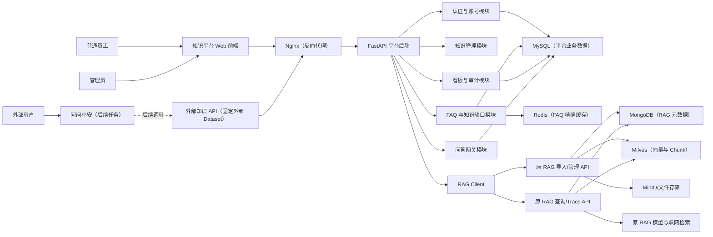
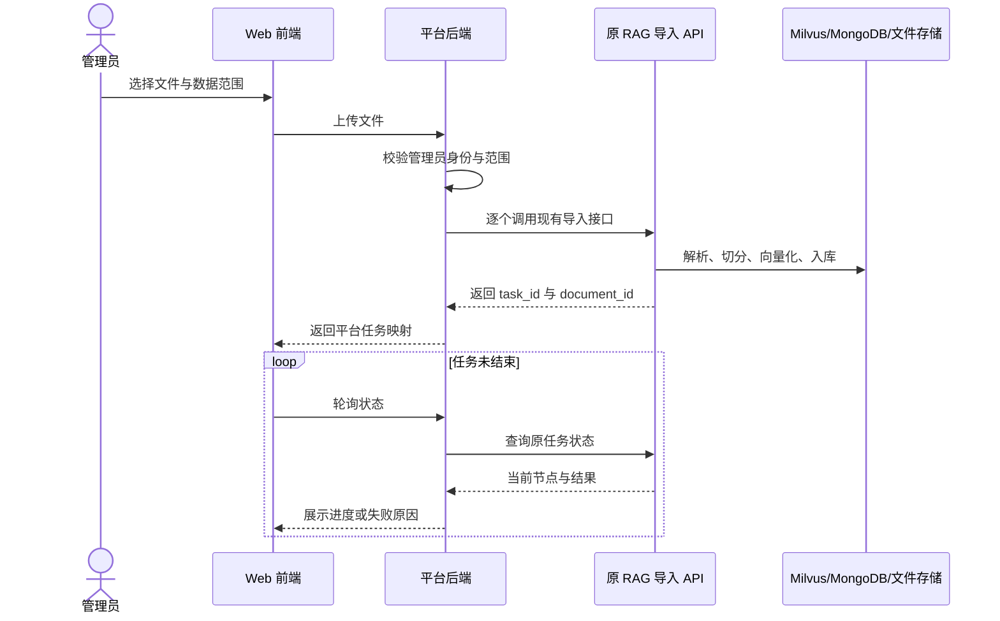
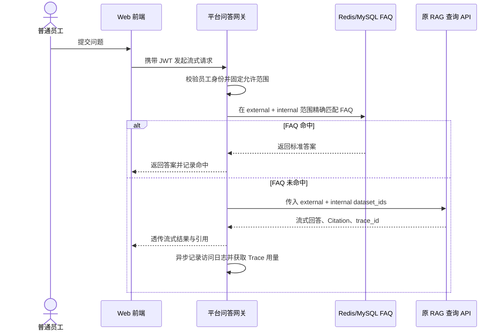
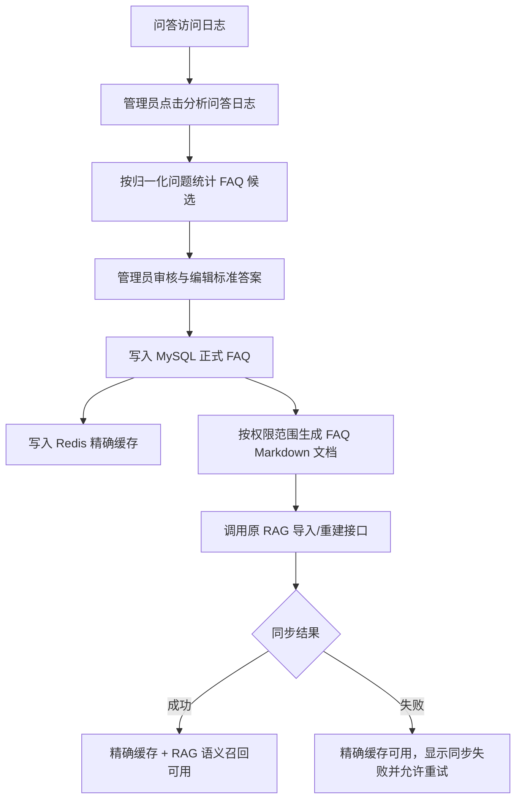

# 券商财富业务知识管理平台：概要设计总纲

## 0. 文档定位

本文是 2.9“知识库管理平台”的概要设计基线，用于统一产品、架构、开发、测试和部署口径，并作为后续执行 Agent（执行智能体）的实施输入。

本文记录的是已经确认的项目决策。原始《项目实战》材料继续保留，但发生冲突时，以本文确认的本项目实施边界为准。

当前阶段只完成设计，不创建项目代码、不修改原 RAG（检索增强生成）和问问小安。

配套实施契约：

- [数据对象设计](./2.9_券商财富业务知识管理平台_数据对象设计.md)
- [API 接口设计](./2.9_券商财富业务知识管理平台_API接口设计.md)

三份文档共同构成执行基线：本文负责范围与架构，数据对象文档负责存储与状态，API（应用程序接口）文档负责调用契约。发生表述差异时不得自行猜测，执行 Agent（执行智能体）应先提出冲突并确认。

### 0.1 前端设计门禁

前端开发开始前，执行 Agent（执行智能体）必须先与用户确认：

- 整体视觉方向；
- 页面布局；
- 导航结构；
- 关键交互；
- 核心页面原型或线框图。

未经确认，不得直接生成整套前端。本文不预设最终颜色、品牌风格和具体组件排版。

---

## 1. 项目身份

### 1.1 项目名称

**券商财富业务知识管理平台**

### 1.2 业务定位

平台面向券商财富业务中的投顾资讯服务产品，统一管理以下知识：

- 投顾资讯产品介绍、服务权益和公开退订规则；
- 非金融产品订单状态、业务错误码和办理规则；
- 问问小安使用的客服知识；
- 券商晨会形成的市场资讯和内部早报；
- 内部客服流程、业务话术和知识运营规则。

这里的“财富业务”不是覆盖证券交易、资产配置、投行、资管等全部券商业务，而是聚焦投顾资讯服务产品及其客服、订单和知识运营场景。

### 1.3 与既有项目的关系

- 非金融订单：提供产品、订单、支付、续费、退订等确定性业务能力。
- 问问小安：面向外部客户的对话入口，通过 `knowledge`（知识咨询）路线访问本平台提供的外部知识 API（应用程序接口）。
- 券商晨会：形成可沉淀的资讯和早报内容，可作为内部知识来源。
- 原 RAG（检索增强生成）：作为底层知识检索与答案生成服务。
- 本平台：作为原 RAG（检索增强生成）的管理、权限、运营和统一访问平台。

项目关系可以概括为：

```text
问问小安负责“用户要做什么”
原 RAG 负责“知识问题如何检索和回答”
本平台负责“知识如何维护、授权、运营和访问”
```

---

## 2. 建设目标

### 2.1 核心目标

1. 建设独立、可部署、可访问的 Web 知识管理平台。
2. 复用原 RAG（检索增强生成）的导入、切分、索引、检索、流式回答和 Citation（引用来源）能力。
3. 建立外部公开、内部共享、管理员专属三档知识范围。
4. 支持管理员进行知识导入、文档管理、Chunk（文本块）启停、FAQ（常见问题）运营和员工账号管理。
5. 支持普通员工进行内部知识问答和历史会话查询。
6. 为问问小安预留固定外部知识范围的服务 API（应用程序接口）。
7. 记录真实访问日志、耗时、引用和可获取的 Token（模型计量单位），形成运营看板。
8. 在单台服务器完成真实部署和验收。

### 2.2 交付定位

项目按照“简历可讲、课程可验收”建设：

- 核心业务链路必须真实运行；
- 不以纯静态页面、假接口或硬编码结果冒充完整能力；
- 不声称已经达到证券公司真实生产环境标准；
- 本地通过不等于服务器部署通过；
- 未实际验证的能力不得写成已完成。

---

## 3. 范围与非范围

### 3.1 本期范围

- 管理员和普通员工登录；
- 员工账号创建、重置密码、启用和停用；
- 三个券商 Dataset（知识库）的幂等初始化；
- 单文件与前端多文件批量导入；
- 导入任务状态查询和失败展示；
- 文档列表、详情、软删除和替换关系；
- Chunk（文本块）查看、启用和停用；
- 普通员工内部问答、流式回答、历史会话和 Citation（引用来源）；
- 外部知识查询 API（应用程序接口）；
- FAQ（常见问题）候选、审核、发布、下线、精确缓存和 RAG（检索增强生成）同步；
- 轻量知识缺口候选；
- 数据看板和关键操作审计；
- MySQL（关系型数据库）结构迁移；
- Redis（缓存数据库）降级；
- Docker Compose（多容器编排）单机部署。

### 3.2 明确不做

- 不重构原 RAG（检索增强生成）核心链路；
- 不删除原设备运维 Dataset（知识库）和数据；
- 不在本期迁移或改写原设备运维业务语义；
- 不实现部门、个人和复杂组织权限；
- 不实现员工反馈功能；
- 不允许在线编辑单个 Chunk（文本块）；
- 不为外部用户建设第二套问答页面；
- 不实现按客户等级、已购产品或订单权益控制知识访问；
- 不在管理平台重复建设 Embedding（语义向量）检索；
- 不新增独立定时任务服务或 Worker（后台任务进程）；
- 不修改原 RAG（检索增强生成）的联网检索、流式输出和 Citation（引用来源）逻辑；
- 不在当前阶段接入问问小安源码。

---

## 4. 用户与权限模型

### 4.1 三种身份

#### 管理员

- 创建、停用和重置普通员工账号；
- 初始化和管理三个券商 Dataset（知识库）；
- 导入、替换、删除文档；
- 查看并启停 Chunk（文本块）；
- 管理 FAQ（常见问题）和知识缺口候选；
- 查看数据看板和操作审计；
- 查询全部三档知识。

#### 普通员工

- 登录平台；
- 进行内部知识问答；
- 查看自己的历史会话；
- 查看答案对应的文档名称、引用片段和来源标识；
- 不访问知识管理、FAQ（常见问题）、知识缺口、员工管理和管理看板。

#### 外部用户

- 不登录知识管理平台；
- 后续通过问问小安访问外部知识查询 API（应用程序接口）；
- 所有外部用户访问相同的公开知识范围；
- 用户身份只用于访问日志，不参与产品权益判断。

### 4.2 三档数据范围

| 数据范围 | 外部用户 | 普通员工 | 管理员 |
|---|---:|---:|---:|
| `external_public`（外部公开） | 可访问 | 可访问 | 可访问 |
| `internal_shared`（内部共享） | 不可访问 | 可访问 | 可访问 |
| `admin_private`（管理员专属） | 不可访问 | 不可访问 | 可访问 |

管理员专属知识对所有管理员可见，不做“仅上传人可见”。

### 4.3 权限实施原则

- 浏览器不得自行决定 Dataset（知识库）范围。
- 平台后端根据已认证身份计算允许范围。
- 外部知识 API（应用程序接口）在服务端固定 `external_public`（外部公开）Dataset（知识库），不接受调用方扩大范围。
- 权限校验发生在调用原 RAG（检索增强生成）之前。
- 平台不实现原始需求中的部门、角色、个人四维混合权限。

---

## 5. 与原 RAG 的集成边界

### 5.1 基本原则

本平台是独立代码仓库和独立部署服务，通过内部 API（应用程序接口）访问原 RAG（检索增强生成），不直接导入原项目 Python 模块，也不复制原项目业务代码。

共享的是 API（应用程序接口）契约，不是源代码。

### 5.2 原 RAG 负责

- Dataset（知识库）、Document（文档）、Chunk（文本块）和索引；
- 文件解析、切分、向量化和导入任务；
- Dense（稠密向量）、Learned Sparse（学习式稀疏向量）、BM25（关键词相关性）等既有混合检索；
- Planner（规划器）内部检索路线选择；
- 流式回答；
- Citation（引用来源）；
- Trace（执行追踪）；
- 既有联网检索行为。

### 5.3 本平台负责

- 管理员和普通员工身份；
- 三种业务身份到三个固定 RAG 服务身份的映射；
- Dataset（知识库）范围选择；
- 正式知识管理页面；
- 文档轻量映射和替换关系；
- FAQ（常见问题）、知识缺口、访问日志、看板和审计；
- 外部知识 API（应用程序接口）；
- RAG Client（RAG 调用客户端）；
- Redis（缓存数据库）降级；
- 面向浏览器和问问小安的统一安全边界。

### 5.4 固定服务身份

平台不把每个员工账号同步到原 RAG（检索增强生成）。平台使用三个内部服务身份：

- 外部查询身份：只能访问 `external_public`（外部公开）；
- 员工查询身份：可以访问 `external_public`（外部公开）和 `internal_shared`（内部共享）；
- 管理员身份：可以管理并访问全部三档范围。

平台数据库记录真实操作人，原 RAG（检索增强生成）记录服务身份和 Trace（执行追踪）。

---

## 6. 总体架构



### 6.1 部署单元

本期不拆微服务。新平台包含：

- Vue 3 前端；
- FastAPI（Python Web 框架）单体后端；
- MySQL（关系型数据库）；
- Redis（缓存数据库）；
- Nginx（反向代理服务器）。

原 RAG（检索增强生成）及其 MongoDB（文档数据库）、Milvus（向量数据库）、文件存储继续独立运行。两套系统部署在同一台服务器，通过内部网络通信。

---

## 7. 技术框架与中间件

### 7.1 前端

- Vue 3；
- TypeScript（类型化 JavaScript）；
- Vite（前端构建工具）；
- Element Plus（企业后台组件库）；
- ECharts（图表库）；
- SSE（服务器推送流）消费；
- 导入任务轮询。

最终视觉方案必须经过用户单独确认。

### 7.2 后端

- Python；
- FastAPI（Python Web 框架）；
- Pydantic（数据契约校验）；
- SQLAlchemy（数据库访问框架）；
- Alembic（数据库结构版本工具）；
- HTTPX（异步 HTTP 客户端）；
- JWT（登录令牌）；
- 密码安全哈希库。

### 7.3 数据与基础设施

- MySQL（关系型数据库）：平台业务数据；
- Redis（缓存数据库）：FAQ（常见问题）精确缓存；
- MongoDB（文档数据库）：原 RAG（检索增强生成）元数据，平台不直接写；
- Milvus（向量数据库）：原 RAG（检索增强生成）向量与 Chunk（文本块）；
- MinIO 或原有文件存储：原 RAG（检索增强生成）文件和图片；
- Nginx（反向代理服务器）：静态页面、反向代理、TLS（传输层加密）终止和基础限流；
- Docker Compose（多容器编排）：单机部署。

---

## 8. Dataset 与环境配置

### 8.1 Dataset 规划

保留原设备运维 Dataset（知识库）不动，新增：

```text
securities_external_public
securities_internal_shared
securities_admin_private
```

具体机器 ID 可在实施时统一命名，但必须稳定、唯一、不可由前端任意修改。

### 8.2 环境配置原则

不通过切换原 RAG（检索增强生成）的 `.env` 改变业务。新平台在自己的环境配置中保存三个 Dataset（知识库）ID，并在每次请求时显式传递。

仓库只提交 `.env.example`，真实 `.env` 仅保存在目标环境，不提交密钥。

示例：

```dotenv
RAG_QUERY_BASE_URL=http://rag-query:8000
RAG_IMPORT_BASE_URL=http://rag-import:8001

RAG_EXTERNAL_DATASET_ID=securities_external_public
RAG_INTERNAL_DATASET_ID=securities_internal_shared
RAG_ADMIN_DATASET_ID=securities_admin_private
```

平台提供幂等初始化命令：首次部署创建三个 Dataset（知识库）及固定服务身份关系；重复执行返回已有结果，不重复创建。

---

## 9. 数据归属与平台数据模型

### 9.1 事实归属

原 RAG（检索增强生成）是 Document（文档）、Chunk（文本块）、索引状态和 Trace（执行追踪）的唯一事实来源。

本平台只保存：

- RAG 资源 ID；
- 平台用户和会话；
- 文档展示映射；
- 新旧文档替换关系；
- FAQ（常见问题）；
- 知识缺口候选；
- 访问日志、看板聚合和操作审计。

### 9.2 建议核心表

#### 身份与认证

- `users`：管理员和普通员工；
- `login_sessions` 或等价令牌撤销记录；

#### 知识映射

- `managed_documents`：平台文档映射、RAG 文档 ID、Dataset（知识库）范围、展示状态；
- `document_replacements`：新旧文档替换关系；

#### 问答

- `chat_sessions`：员工会话；
- `chat_messages`：用户问题、回答、Trace（执行追踪）ID 和状态；
- `qa_access_logs`：调用渠道、用户、Dataset（知识库）范围、耗时、引用和可获取的 Token（模型计量单位）；

#### FAQ 与知识缺口

- `faqs`：标准问题、标准答案、数据范围、审核状态、命中次数、RAG 同步状态；
- `faq_candidates`：候选问题、归一化问题、频次和来源；
- `knowledge_gap_candidates`：候选问题、频次、状态和管理员处理结果；

#### 审计

- `audit_logs`：管理员关键写操作；

### 9.3 MySQL 隔离

平台使用服务器现有 MySQL（关系型数据库），但必须创建独立数据库和独立账号，不复用其他项目的数据表和高权限账号。

Alembic（数据库结构版本工具）只管理真实表结构变化，第一版至少包含可复现的初始版本。

---

## 10. 核心流程

### 10.1 管理员导入知识



批量导入由前端一次选择多个文件，后台仍逐个调用原导入接口。平台不修改原 RAG（检索增强生成）导入服务。

### 10.2 文档替换

```text
上传新文件
→ 原 RAG 完成新文档导入
→ 平台确认新文档可检索
→ 平台调用原删除接口处理旧文档
→ Milvus 旧 Chunk 物理删除
→ 旧文档元数据软删除
→ 平台记录新旧 document_id 替换关系
```

若新文档导入失败，不删除旧文档。

原 RAG（检索增强生成）的“重建索引”继续用于同一原始文件重新切分和索引，并沿用既有 `index_version`（索引版本）逻辑。

### 10.3 Chunk 管理

```text
管理员查看文档
→ 查看当前 index_version 下的 Chunk
→ 发现错误或不适合展示的 Chunk
→ 先禁用 Chunk
→ 后续回到源文档或切分规则重新处理
```

不允许直接在线编辑 Chunk（文本块）。源文档才是内容事实来源。

### 10.4 普通员工内部问答



### 10.5 外部知识查询

```text
问问小安（后续）
→ 携带 Service API Key 调用平台外部知识 API
→ 平台固定 external_public Dataset
→ 外部 FAQ 精确匹配
→ 未命中则调用原 RAG
→ 原样保留原 RAG 的本地/联网路线、流式回答和 Citation
→ 返回问问小安
```

外部调用方不能提交或扩大 Dataset（知识库）范围。

原 RAG（检索增强生成）当前如果触发联网检索，可能返回互联网信息。这是本期明确接受的既有行为；本平台只保证其不能访问内部 Dataset（知识库），不额外限制原 RAG（检索增强生成）路线。

### 10.6 FAQ 闭环



FAQ（常见问题）在平台层只做归一化后的精确匹配，不再建设第二套语义向量检索。语义近似问题由原 RAG（检索增强生成）通过已导入的 FAQ 文档召回。

每个范围维护一份 FAQ Markdown 文档：

- 外部公开 FAQ 文档；
- 内部共享 FAQ 文档；
- 管理员专属 FAQ 文档。

已经发布的标准问题不重复进入候选，但继续累计命中次数。

### 10.7 知识缺口候选

```text
RAG 返回无引用或证据不足
→ 平台记录 gap_candidate
→ 管理员查看候选
→ 标记忽略或已解决
```

约束：

- 系统异常、超时和服务不可用进入运行日志，不进入知识缺口；
- 候选不等于确认的知识缺口；
- 用户 Query（查询问题）本身可能有问题；
- 不自动创建知识，不自动修改知识库；
- 本功能属于轻量运营辅助，不是核心问答链路。

---

## 11. FAQ 权限与命中规则

每条 FAQ（常见问题）绑定一个数据范围，并遵循与 RAG（检索增强生成）一致的访问矩阵。

允许范围内存在同一归一化问题时，匹配顺序为：

```text
管理员专属 > 内部共享 > 外部公开
```

外部用户永远只查询外部公开 FAQ（常见问题）。

Redis（缓存数据库）的 Cache Key（缓存键）必须包含数据范围，禁止使用全局“问题直接映射答案”的键。

Redis（缓存数据库）不可用时，平台回退到 MySQL（关系型数据库）精确查询；MySQL（关系型数据库）也不可用时返回明确服务错误，不绕过权限调用自由回答。

---

## 12. API 概要

以下是概要契约，详细字段由执行 Agent（执行智能体）在实现前形成 OpenAPI（接口描述规范）并复核。

### 12.1 认证与员工

- `POST /api/auth/login`
- `GET /api/auth/me`
- `POST /api/admin/users`
- `PATCH /api/admin/users/{user_id}`
- `POST /api/admin/users/{user_id}/reset-password`

### 12.2 Dataset 与文档

- `POST /api/admin/bootstrap`
- `GET /api/admin/datasets`
- `POST /api/admin/documents/import`
- `GET /api/admin/import-tasks/{task_id}`
- `GET /api/admin/documents`
- `GET /api/admin/documents/{document_id}`
- `POST /api/admin/documents/{document_id}/replace`
- `DELETE /api/admin/documents/{document_id}`
- `GET /api/admin/documents/{document_id}/chunks`
- `PATCH /api/admin/documents/{document_id}/chunks/{chunk_id}/status`

### 12.3 内部问答

- `POST /api/chat/sessions`
- `GET /api/chat/sessions`
- `GET /api/chat/sessions/{session_id}/messages`
- `POST /api/chat/sessions/{session_id}/stream`

### 12.4 外部知识

- `POST /api/external/knowledge/stream`
- `GET /api/external/knowledge/health`

外部接口使用 Service API Key（服务调用密钥），服务端固定外部 Dataset（知识库）。

### 12.5 FAQ 与知识缺口

- `POST /api/admin/insights/analyze`
- `GET /api/admin/faqs/candidates`
- `POST /api/admin/faqs/{candidate_id}/publish`
- `PATCH /api/admin/faqs/{faq_id}`
- `POST /api/admin/faqs/{faq_id}/unpublish`
- `POST /api/admin/faqs/{faq_id}/retry-sync`
- `GET /api/admin/knowledge-gaps`
- `PATCH /api/admin/knowledge-gaps/{gap_id}`

### 12.6 看板与审计

- `GET /api/admin/dashboard/summary`
- `GET /api/admin/dashboard/trends`
- `GET /api/admin/dashboard/rankings`
- `GET /api/admin/audit-logs`

---

## 13. 状态、一致性与失败规则

### 13.1 文档导入

- 原 RAG（检索增强生成）任务状态是导入执行事实；
- 平台保存任务映射和最近一次同步状态；
- 导入失败必须展示原失败节点和可安全展示的错误；
- 不把失败显示为“处理中”；
- 新文档成功前不得删除旧文档。

### 13.2 FAQ 发布

- MySQL（关系型数据库）是 FAQ（常见问题）正式状态的事实来源；
- Redis（缓存数据库）是可重建加速层；
- RAG（检索增强生成）同步失败不回滚已审核标准答案；
- 同步失败必须有明确状态、错误摘要和重试入口；
- 更新或下线 FAQ（常见问题）后必须刷新对应范围缓存并重建对应 FAQ 文档。

### 13.3 RAG 不可用

- 内部员工收到明确的知识服务不可用提示；
- 外部 API（应用程序接口）返回稳定错误码；
- 问问小安后续接入时应提示稍后重试或转人工；
- 禁止脱离证据让大模型自由回答。

### 13.4 Token 与看板数据

- 查询主响应没有 Token（模型计量单位）时，通过返回的 `trace_id`（执行追踪 ID）异步查询原 Trace API（执行追踪接口）；
- 只保存实际可获得的真实用量；
- 原服务未返回或 Provider（模型服务提供方）不支持用量时显示“暂无数据”或 `null`，不得估算；
- Planner（规划器）用量当前可能为 0，不能解释为真实零成本。

---

## 14. 安全设计

### 14.1 身份安全

- 管理员和普通员工使用用户名、密码登录；
- 不开放自主注册；
- 初始管理员通过部署初始化创建；
- 密码使用安全哈希保存；
- JWT（登录令牌）设置有效期；
- 每次请求检查用户当前状态，员工被停用后已有令牌立即失效。

### 14.2 服务调用安全

- 问问小安后续使用 Service API Key（服务调用密钥）；
- 服务密钥只保存在环境变量或密钥配置中；
- RAG（检索增强生成）接口不直接暴露到公网；
- 浏览器只访问平台 API（应用程序接口）；
- 平台调用 RAG（检索增强生成）使用内部地址、超时和连接池；
- 不信任调用方提交的 Dataset（知识库）范围。

### 14.3 输入与文件安全

- 复用原 RAG（检索增强生成）支持的文件格式、大小和解析规则；
- 平台不额外声称支持新格式；
- 文件名、路径和下载权限必须校验；
- 接口参数使用 Pydantic（数据契约校验）统一验证；
- 日志不得记录密码、JWT（登录令牌）、Service API Key（服务调用密钥）和完整敏感正文。

### 14.4 审计范围

只记录管理员关键写操作：

- 员工账号创建、停用和重置；
- 文档导入、替换和删除；
- Chunk（文本块）启停；
- FAQ（常见问题）发布、修改、下线和同步重试；
- Dataset（知识库）初始化。

不记录普通页面点击。

---

## 15. 页面范围

### 15.1 管理员

- 登录页；
- 数据看板；
- 知识导入与任务状态；
- 文档列表与详情；
- Chunk（文本块）查看与启停；
- 员工账号管理；
- FAQ（常见问题）候选与正式库；
- 知识缺口候选；
- 内部问答与历史会话；
- 操作审计。

### 15.2 普通员工

- 登录页；
- 内部问答；
- 历史会话；
- Citation（引用来源）卡片。

普通员工不显示管理菜单。

### 15.3 外部用户

本平台不提供外部用户页面。外部交互由问问小安承担。

### 15.4 交互技术

- 问答采用 SSE（服务器推送流）；
- 文档导入采用轮询；
- 不引入 WebSocket（双向长连接）；
- 管理员登录后进入看板；
- 普通员工登录后进入内部问答。

---

## 16. 示例语料与演示账号

### 16.1 示例语料

使用虚构券商和虚构产品，不把演示数据包装成真实公司的生产数据。

#### 外部公开

- 投顾资讯产品介绍；
- 服务权益；
- 公开退订规则；
- 面向客户的标准 FAQ（常见问题）。

#### 内部共享

- 订单状态说明；
- 客服办理流程；
- 业务错误码；
- 内部客服话术。

#### 管理员专属

- 知识运营规则；
- 异常处理记录；
- 系统操作手册。

### 16.2 演示身份

- 一个管理员账号；
- 一个普通员工账号；
- 一个问问小安服务身份，仅做接口契约测试。

---

## 17. 工程规范

### 17.1 架构规范

- 新平台采用边界清楚的单体，不为未来假设拆微服务；
- 前端只调用平台后端，不直接调用 RAG（检索增强生成）；
- RAG Client（RAG 调用客户端）是访问原 RAG（检索增强生成）的唯一出口；
- MySQL（关系型数据库）与原 MongoDB（文档数据库）职责分离；
- Redis（缓存数据库）永远不是正式数据唯一来源；
- 不跨仓库直接导入 Python 模块。

### 17.2 命名规范

- 同一业务概念只使用一个名称；
- 避免含糊的 `Manager`、`Helper`、`Utils`、`Common`；
- 类型和类使用职责明确的名词；
- 方法使用表达结果或副作用的动词；
- 读取方法不得隐藏写操作；
- 布尔方法优先使用 `is`、`has`、`can` 前缀；
- API（应用程序接口）、数据库字段和状态枚举必须有稳定业务语义。

### 17.3 后端规范

- 路由层只处理协议、身份和响应映射；
- 业务规则进入服务层；
- 外部依赖通过 Client（调用客户端）隔离；
- 数据库访问集中在 Repository（数据访问层）；
- 在系统边界校验输入；
- 不吞异常；
- 只有能够恢复、转换或补充上下文时才捕获异常；
- 所有外部调用设置连接超时、读取超时和明确错误映射；
- 导入、替换、初始化和 FAQ 同步必须具备幂等或安全重试语义。

### 17.4 前端规范

- TypeScript（类型化 JavaScript）开启严格类型；
- 统一 API Client（接口调用客户端）；
- 权限菜单隐藏与后端权限校验同时存在，前端隐藏不能替代后端鉴权；
- SSE（服务器推送流）断开要展示状态并允许重试；
- 导入任务状态与失败原因必须可见；
- 不使用静态假数据冒充已接入接口；
- 最终视觉实现必须通过前端设计门禁。

### 17.5 配置与密钥

- 配置与代码分离；
- 仓库只提交 `.env.example`；
- 不提交真实数据库密码、JWT 密钥和 Service API Key；
- 本地、测试和服务器配置使用同一字段契约；
- 启动时校验必需配置，缺失时明确失败。

### 17.6 数据库规范

- MySQL（关系型数据库）使用独立数据库和账号；
- Alembic（数据库结构版本工具）保存初始结构和真实变化；
- 数据库状态枚举有明确迁移路径；
- 关键查询建立必要索引；
- 不通过应用启动时无条件 `create_all` 替代正式迁移；
- 种子账号和演示数据通过幂等初始化命令创建。

---

## 18. 建议实施顺序

### 阶段 0：设计与前端确认

- 确认本文；
- 执行 Agent（执行智能体）与用户确认视觉方案和页面原型；
- 核对目标服务器和原 RAG（检索增强生成）实际运行地址；
- 冻结 API（应用程序接口）契约和状态枚举。

### 阶段 1：工程与部署基线

- 创建独立仓库；
- 建立前后端、格式化、静态检查、测试和构建基线；
- 建立 MySQL（关系型数据库）初始迁移；
- 建立 Docker Compose（多容器编排）和 `.env.example`；
- 完成健康检查。

### 阶段 2：身份与 Dataset 初始化

- 管理员、普通员工登录；
- 账号管理；
- 三个固定 RAG 服务身份；
- 三个券商 Dataset（知识库）的幂等初始化；
- 权限矩阵测试。

### 阶段 3：知识管理纵向切片

- 单文件导入；
- 多文件前端批量提交；
- 任务轮询；
- 文档列表、详情和软删除；
- Chunk（文本块）查看与启停；
- 文档替换。

### 阶段 4：内部问答纵向切片

- 会话与消息；
- FAQ（常见问题）精确匹配；
- RAG（检索增强生成）流式转发；
- Citation（引用来源）；
- Trace（执行追踪）和访问日志。

### 阶段 5：FAQ、知识缺口与看板

- 手动触发日志分析；
- FAQ（常见问题）候选审核和发布；
- Redis（缓存数据库）降级；
- 三份 FAQ 文档同步；
- 轻量知识缺口候选；
- 看板与审计。

### 阶段 6：服务器部署与验收

- 单服务器部署；
- 页面公网可访问；
- 原 RAG（检索增强生成）只走内部网络；
- 验证正常路径、失败路径和权限边界；
- 保存测试结果和页面截图。

### 阶段 7：问问小安后续接入

仅在以下条件全部满足后开始：

1. 原 RAG（检索增强生成）券商 Dataset（知识库）和接口验证通过；
2. 知识管理平台验收通过；
3. 外部知识 API（应用程序接口）契约测试通过；
4. 找到并核对问问小安真实源码。

本阶段属于后续任务，不计入本轮首期验收。

---

## 19. 验收标准

### 19.1 核心正常链路

1. 管理员能够登录并创建、停用和重置普通员工账号。
2. 初始化命令能够创建三个券商 Dataset（知识库），重复执行不重复创建。
3. 管理员能够导入单个和多个文档并查看真实任务状态。
4. 管理员能够查看文档、Chunk（文本块）并执行启停。
5. 新文档导入失败时旧文档继续可检索；新文档成功后才能替换旧文档。
6. 普通员工只能访问外部公开和内部共享知识。
7. 管理员能够访问全部三档知识。
8. 外部知识 API（应用程序接口）只能访问外部公开知识。
9. 内部问答能够流式输出，并展示真实 Citation（引用来源）。
10. FAQ（常见问题）能够从日志生成候选，经管理员审核后进入 MySQL（关系型数据库）和 Redis（缓存数据库）。
11. 精确 FAQ（常见问题）未命中时能够进入原 RAG（检索增强生成）链路。
12. 三份 FAQ 文档能够同步到对应 Dataset（知识库）。
13. 无引用或证据不足的问题能够生成轻量知识缺口候选。
14. 看板能够展示真实访问次数、独立用户数、知识数量、高频问题、热门知识、响应耗时和可获取的 Token（模型计量单位）。
15. 系统能够在目标服务器启动并通过实际地址访问。

### 19.2 必测失败路径

- 外部身份请求内部或管理员知识；
- 普通员工请求管理员专属知识；
- 非管理员调用写接口；
- RAG（检索增强生成）不可用；
- Redis（缓存数据库）不可用并回退 MySQL（关系型数据库）；
- MySQL（关系型数据库）不可用；
- FAQ（常见问题）同步 RAG（检索增强生成）失败并重试；
- 文档导入失败；
- 文档处理过程中发起删除；
- 重复执行 Dataset（知识库）初始化；
- JWT（登录令牌）过期；
- 员工被停用后使用旧令牌；
- 外部调用提交伪造 Dataset（知识库）ID。

### 19.3 交付物

- 不包含依赖目录的完整源代码；
- `.env.example`；
- Alembic（数据库结构版本工具）迁移；
- Docker Compose（多容器编排）；
- 初始化命令；
- API（应用程序接口）文档；
- 本地运行说明；
- 服务器部署和回滚说明；
- 自动化测试结果；
- 核心链路测试截图；
- 已实现与未实现范围说明；
- 已知风险和证据边界说明。

---

## 20. 已知边界与风险

1. 原 RAG（检索增强生成）当前属于轻量单租户权限体系，本平台通过固定 Dataset（知识库）和内部服务身份形成业务隔离，不等同于证券公司真实多租户生产权限平台。
2. 外部路线继续保留原 RAG（检索增强生成）既有联网检索行为，因此“只能访问外部 Dataset”不等于“答案只来自已审核本地知识”。
3. FAQ（常见问题）平台层只做归一化精确匹配，语义近似依赖原 RAG（检索增强生成）对 FAQ 文档的召回。
4. 知识缺口只是候选运营信号，不能自动归因于知识库缺失。
5. Token（模型计量单位）只展示原 Trace（执行追踪）中实际可获取的值，Planner（规划器）用量可能缺失或为 0。
6. 单服务器部署满足课程演示和简历讲解，不代表完成高可用、容灾和生产容量验证。
7. 问问小安源码尚未定位；当前只交付外部知识 API（应用程序接口）和契约测试，源码接入属于后续任务。
8. 前端视觉尚未确认，是正式开发前必须解除的门禁。

---

## 21. 后续执行 Agent 的启动检查清单

执行 Agent（执行智能体）在开始编码前必须完成：

- [ ] 完整阅读本文；
- [ ] 与用户确认前端视觉和原型；
- [ ] 核对当前工作目录和独立仓库目标路径；
- [ ] 核对原 RAG（检索增强生成）真实运行地址和接口；
- [ ] 验证三个 Dataset（知识库）可以通过现有接口创建和访问；
- [ ] 核对原 RAG（检索增强生成）当前支持的导入格式和状态；
- [ ] 核对目标服务器 MySQL（关系型数据库）、端口、域名和磁盘资源；
- [ ] 输出可审查的目录树、模块边界、API（应用程序接口）契约和数据表设计；
- [ ] 按纵向切片实施，不按技术分层一次性铺开；
- [ ] 每个切片完成后运行真实检查；
- [ ] 不修改本文已经冻结的业务边界，确需变更时先说明影响并征得用户确认。
